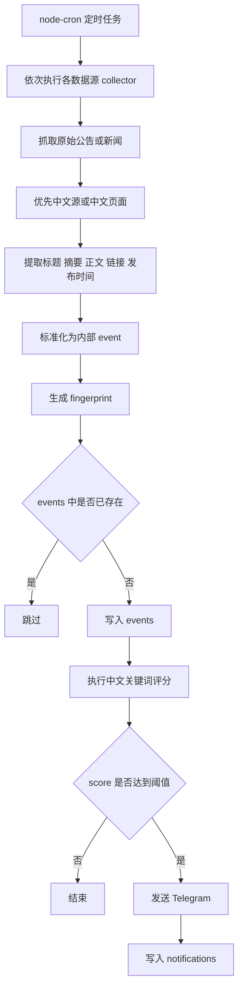
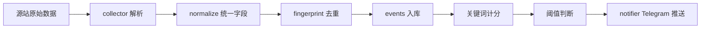
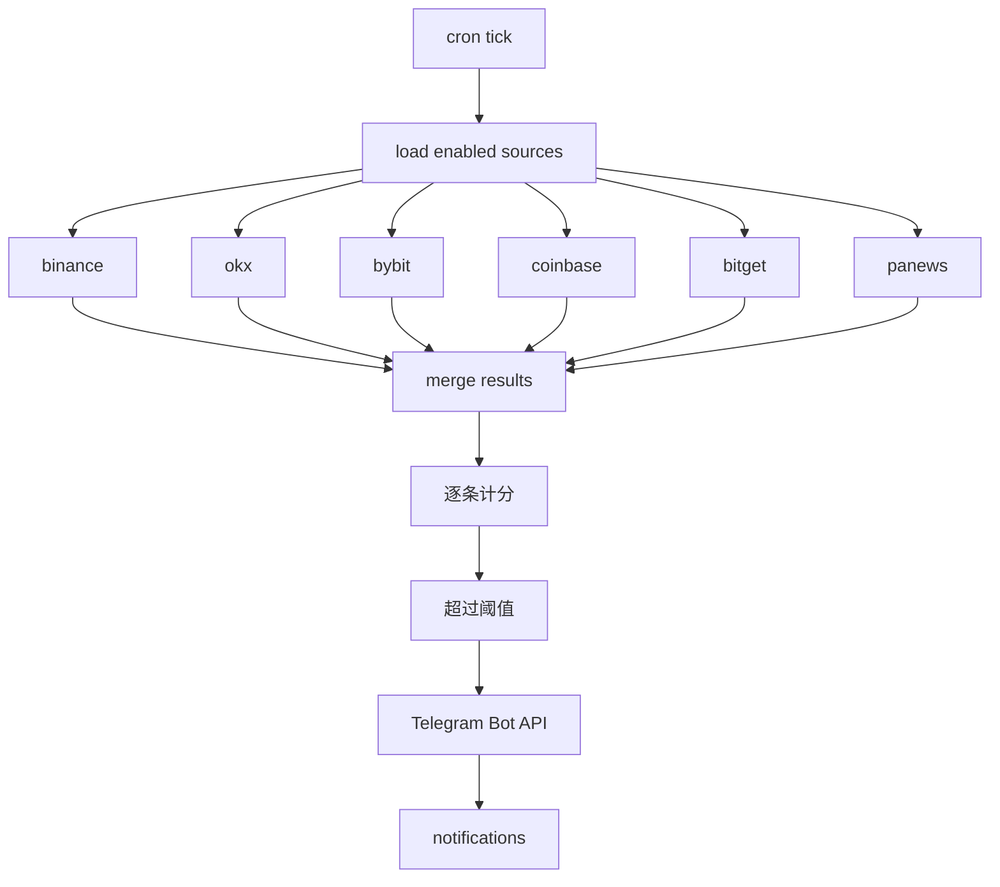

# quantitativeEventDrivenTrading v0.0.1

## 当前目标

第一版先做一个能稳定跑起来的事件监控与 Telegram 推送服务。

当前范围只包含：

- 5 个交易所公告抓取
- PANews 新闻抓取
- 简单规则筛选
- Telegram 推送
- PostgreSQL 持久化与去重

本版本不包含：

- 链上大户监控
- AI 摘要或复杂评分系统
- Web 管理后台
- 多实例部署
- Redis

## 第一版设计原则

- 先跑起来，不做平台化过度设计
- 使用 Node.js 单体服务
- 规则先放代码配置，不先做数据库规则管理
- 数据源配置先放代码配置，不先做 `sources` 表
- 使用 PostgreSQL 作为唯一数据库
- Redis 第一版不上
- 标题、摘要、正文统一以中文内容入库
- 过滤规则统一只针对中文内容执行
- 数据库存储时间使用 UTC 或时间戳，展示时统一转换为北京时间

## 计划接入的数据源

交易所公告：

- Binance
- OKX
- Bybit
- Coinbase
- Bitget

新闻源：

- PANews

## 技术选型

- 运行时：Node.js
- 抓取：`axios` 或 `got`
- HTML 解析：`cheerio`
- 定时任务：`node-cron`
- Telegram 推送：Telegram Bot API
- 数据库：PostgreSQL
- ORM/建表工具：待定，可选 `drizzle` 或 `prisma`

## 环境变量建议

第一版至少需要以下环境变量：

- `DATABASE_URL`
- `TELEGRAM_BOT_TOKEN`
- `TELEGRAM_CHAT_ID`

说明：

- `DATABASE_URL` 用于提供 PostgreSQL 连接信息
- 如果不想使用 `DATABASE_URL`，也可以拆成独立的 PG 连接参数

## 数据源接入策略

第一版接入策略按以下优先级执行：

1. 优先使用官方 API
2. 如果没有可用 API，则抓取网页
3. 优先抓取中文站点或中文页面

这样做的原因：

- 官方 API 通常更稳定，字段更清晰
- 中文源优先可以避免引入翻译链路
- 第一版规则和推送都基于中文内容，中文源优先更适合当前目标

## 轮询间隔建议

第一版不建议所有数据源统一使用同一个抓取间隔，而是按来源类型分别设置。

建议默认值：

- Binance：每 `3` 分钟抓取一次
- OKX：每 `3` 分钟抓取一次
- Bybit：每 `3` 分钟抓取一次
- Coinbase：每 `3` 分钟抓取一次
- Bitget：每 `3` 分钟抓取一次
- PANews：每 `2` 分钟抓取一次

这样设置的原因：

- 交易所公告更新频率通常不高，`3` 分钟足够及时
- PANews 属于新闻流，更新更频繁，适合更短轮询
- 第一版更重要的是稳定抓取，而不是极限低延迟
- 过短轮询会增加请求失败率、风控概率和无效请求量

第一版不建议使用：

- 所有来源统一 `10` 秒
- 所有来源统一 `30` 秒
- 所有来源统一 `1` 分钟

第一版调度建议：

- 每个源单独配置 `pollIntervalSec`
- 不要让所有源在同一秒同时发起请求
- 在单次轮询周期内尽量串行抓取，或做轻量错峰
- 先按默认值跑几天，再根据稳定性和更新频率调整

## 为什么第一版只上 PostgreSQL

PostgreSQL 在第一版承担以下职责：

- 保存抓取到的事件数据
- 做事件去重
- 记录筛选结果
- 记录关键词得分
- 记录 Telegram 推送记录
- 支撑后续问题排查和规则调整

Redis 暂时不上，原因是当前没有这些强需求：

- 多实例部署
- 分布式锁
- 高频缓存去重
- 消息队列
- 复杂限流

后续如果要扩展，再考虑把 Redis 用于：

- 短时间去重缓存
- 分布式锁
- 异步任务队列
- 推送限流

## 第一版最小系统流程

1. 定时任务按周期轮询所有启用的数据源
2. 各数据源抓取最新公告或新闻
3. 优先使用中文数据源或中文页面
4. 将不同来源统一标准化为内部事件结构
5. 生成事件 `fingerprint`
6. 数据库查重，已存在则跳过
7. 新事件写入 `events`
8. 执行中文关键词评分
9. 分数达到阈值则发送 Telegram
10. 发送结果写入 `notifications`

## Mermaid 图

### 总体流程图



### 单条事件处理局部图



### 定时调度与推送局部图



## 第一版项目结构

下面是建议直接落地的第一版目录。目标是简单、单体、职责清楚，不为了扩展性过度拆分。

```text
quantitativeEventDrivenTrading/
├── roleflow/
│   └── implementations/
│       └── 0.0.1/
│           └── README.md
├── src/
│   ├── index.ts
│   ├── bootstrap.ts
│   ├── config/
│   │   ├── env.ts
│   │   ├── sources.ts
│   │   └── rules.ts
│   ├── collectors/
│   │   ├── binance.ts
│   │   ├── okx.ts
│   │   ├── bybit.ts
│   │   ├── coinbase.ts
│   │   ├── bitget.ts
│   │   ├── panews.ts
│   │   └── types.ts
│   ├── services/
│   │   ├── collect.service.ts
│   │   ├── normalize.service.ts
│   │   ├── filter.service.ts
│   │   └── notify.service.ts
│   ├── db/
│   │   ├── client.ts
│   │   ├── schema.ts
│   │   ├── events.repo.ts
│   │   └── notifications.repo.ts
│   ├── jobs/
│   │   └── poll.job.ts
│   ├── types/
│   │   ├── source.ts
│   │   ├── event.ts
│   │   └── rule.ts
│   └── utils/
│       ├── fingerprint.ts
│       ├── logger.ts
│       ├── text.ts
│       └── time.ts
├── package.json
├── tsconfig.json
├── .env.example
└── drizzle/
    └── migrations/
```

## 文件职责说明

### 入口与启动

- `src/index.ts`
  进程入口。负责启动应用。
- `src/bootstrap.ts`
  初始化数据库连接、加载配置、注册 cron 任务。

### 配置

- `src/config/env.ts`
  读取并校验环境变量，例如数据库连接、Telegram token、chat id。
- `src/config/sources.ts`
  定义启用的数据源、轮询周期、基础 URL、来源标识。
- `src/config/rules.ts`
  定义中文关键词、每个关键词的分值、阈值、排除词。

### 数据抓取

- `src/collectors/types.ts`
  定义各 collector 返回的原始统一结构。
- `src/collectors/binance.ts`
  抓 Binance 公告。
- `src/collectors/okx.ts`
  抓 OKX 公告。
- `src/collectors/bybit.ts`
  抓 Bybit 公告。
- `src/collectors/coinbase.ts`
  抓 Coinbase 公告。
- `src/collectors/bitget.ts`
  抓 Bitget 公告。
- `src/collectors/panews.ts`
  抓 PANews 新闻。

### 核心服务

- `src/services/collect.service.ts`
  统一调度各 collector，汇总抓取结果。
- `src/services/normalize.service.ts`
  将不同来源统一为内部 `event` 结构。
- `src/services/filter.service.ts`
  对中文内容执行关键词计分，给出 `score`、`matched` 和 `matched_rule`。
- `src/services/notify.service.ts`
  负责构造 Telegram 消息并发送。

### 数据库

- `src/db/client.ts`
  数据库连接初始化。
- `src/db/schema.ts`
  定义 `events` 和 `notifications` 表结构。
- `src/db/events.repo.ts`
  负责事件查重、写入、查询。
- `src/db/notifications.repo.ts`
  负责推送记录写入和查询。

### 定时任务

- `src/jobs/poll.job.ts`
  轮询所有来源，串起抓取、中文化、标准化、去重、过滤、推送全流程。

### 类型定义

- `src/types/source.ts`
  定义数据源配置类型。
- `src/types/event.ts`
  定义内部事件结构类型。
- `src/types/rule.ts`
  定义规则结构类型。

### 工具函数

- `src/utils/fingerprint.ts`
  根据 `source_key + url + normalized title` 生成唯一指纹。
- `src/utils/logger.ts`
  统一日志输出。
- `src/utils/text.ts`
  文本清洗、截断、空白规范化。
- `src/utils/time.ts`
  时间解析与格式化。

## 第一版结构设计说明

这个目录拆法有几个明确目的：

- 每个交易所和 PANews 独立一个 collector，后续站点改版时只改单文件
- 抓取、标准化、筛选、推送分别放在 service 层，职责不会混在一起
- 数据库访问集中在 repo 文件，避免业务逻辑里散落 SQL
- 第一版只保留一个 `poll.job.ts`，避免任务系统过度复杂

## 第一版单次轮询内部步骤

1. `poll.job.ts` 触发
2. `collect.service.ts` 读取 `sources.ts`
3. 逐个调用各个 collector
4. collector 返回原始字段
5. `normalize.service.ts` 统一字段名
6. `fingerprint.ts` 生成指纹
7. `events.repo.ts` 查重并写入
8. `filter.service.ts` 用 `rules.ts` 执行中文关键词计分
9. 分数达到阈值后由 `notify.service.ts` 推送
10. `notifications.repo.ts` 写推送记录

## 当前确认的数据库方案

第一版只建两张表：

- `events`
- `notifications`

暂不建：

- `sources`
- `rules`
- `raw_events`

说明：

- `sources` 先放代码配置
- `rules` 先放代码配置
- `raw_events` 先不拆，原始抓取内容直接保存在 `events.raw_payload`

## 中文内容要求

第一版统一要求：

- 优先抓取中文站点或中文页面
- `title` 存中文标题
- `summary` 存中文摘要
- `content` 存中文正文
- 过滤规则只针对中文字段执行
- 数据库存储时间使用 UTC 或时间戳，展示时统一转换为北京时间

### summary 生成规则

- 有源站摘要时，直接使用源站摘要
- 没有摘要时，从正文中截取前一段内容作为摘要
- 如果没有正文，则 `summary` 允许为空

## events 表草案

用途：

- 持久化事件
- 做唯一性去重
- 保存筛选结果
- 保存关键词评分结果
- 保留原始载荷，便于后续排查和补规则

为保持第一版足够轻，`events` 只保留最小必要字段。

建议字段如下：

### 1. id

- 类型：`bigserial` 或 `uuid`
- 建议：第一版使用 `bigserial`
- 用途：主键

### 2. source_key

- 类型：`text`
- 示例：`binance`、`okx`、`bybit`、`coinbase`、`bitget`、`panews`
- 用途：标识来源
- 约束：必填

### 3. title

- 类型：`text`
- 用途：中文标题
- 约束：必填

### 4. summary

- 类型：`text`
- 用途：中文摘要
- 约束：可空

### 5. content

- 类型：`text`
- 用途：中文正文
- 约束：可空

### 6. url

- 类型：`text`
- 用途：原文链接
- 约束：必填

### 7. published_at

- 类型：`timestamptz`
- 用途：原始发布时间
- 约束：可空
- 说明：数据库按 UTC 或时间戳存储，展示时转换为北京时间

### 8. fetched_at

- 类型：`timestamptz`
- 用途：系统抓取时间
- 约束：必填
- 说明：数据库按 UTC 或时间戳存储，展示时转换为北京时间

### 9. fingerprint

- 类型：`text`
- 用途：事件唯一指纹，用于去重
- 约束：必填
- 建议：唯一索引
- 说明：建议由 `source_key + url + normalized title` 生成 hash

### 10. raw_payload

- 类型：`jsonb`
- 用途：保存抓取到的原始结构
- 约束：必填
- 说明：用于排查解析问题、回放历史数据、补规则

### 11. matched

- 类型：`boolean`
- 用途：记录是否达到推送阈值
- 约束：必填
- 建议默认值：`false`

### 12. matched_rule

- 类型：`text`
- 用途：记录命中的规则名称
- 约束：可空

### 13. score

- 类型：`integer`
- 用途：记录关键词计分结果
- 约束：必填
- 建议默认值：`0`
- 说明：允许为负数

### 14. created_at

- 类型：`timestamptz`
- 用途：入库时间
- 约束：必填
- 说明：数据库按 UTC 或时间戳存储，展示时转换为北京时间

### events 表索引建议

- `unique(fingerprint)`
- `index(source_key, fetched_at desc)`
- `index(matched, fetched_at desc)`
- `index(published_at desc)`

### events 表补充说明

- 标题如果发生变化，可视为新的事件
- 第一版不额外做“同链接标题更新”的合并逻辑

## notifications 表草案

用途：

- 记录哪些事件已经推送
- 记录推送目标和推送结果
- 避免同一事件重复推送到同一 Telegram 目标

为保持第一版足够轻，`notifications` 也只保留最小必要字段。

建议字段如下：

### 1. id

- 类型：`bigserial` 或 `uuid`
- 建议：第一版使用 `bigserial`
- 用途：主键

### 2. event_id

- 类型：`bigint` 或对应 `events.id` 的类型
- 用途：关联 `events`
- 约束：必填

### 3. target

- 类型：`text`
- 示例：Telegram `chat_id`
- 用途：推送目标
- 约束：必填

### 4. status

- 类型：`text`
- 示例：`success`、`failed`
- 用途：推送结果
- 约束：必填

### 5. error_message

- 类型：`text`
- 用途：发送失败时的错误原因
- 约束：可空

### 6. sent_at

- 类型：`timestamptz`
- 用途：实际发送时间
- 约束：可空
- 说明：数据库按 UTC 或时间戳存储，展示时转换为北京时间

### 7. created_at

- 类型：`timestamptz`
- 用途：记录创建时间
- 约束：必填
- 说明：数据库按 UTC 或时间戳存储，展示时转换为北京时间

### notifications 表约束与索引建议

- `unique(event_id, target)`
- `index(event_id)`
- `index(status, created_at desc)`

## 规则设计的当前结论

第一版规则不进数据库，先放代码配置。

第一版规则能力只做最小集合：

- 来源过滤
- 中文标题关键词匹配
- 中文摘要/正文关键词匹配
- 关键词计分
- 分数阈值判断
- 排除关键词
- 命中规则名记录

不做：

- 复杂 DSL
- 多语言规则
- 可视化规则管理

## 第一版评分机制

第一版规则不做复杂 DSL，直接使用“关键词计分 + 阈值判断”。

建议实现方式：

- 先维护一组中文关键词
- 每命中一个关键词，就累加对应分值
- 最终得到事件总分 `score`
- 当 `score >= threshold` 时，认为该事件需要推送

第一版可以先从最简单版本开始：

- 普通关键词：`+1`
- 更重要的关键词：`+2` 或 `+3`
- 排除关键词：一旦命中，直接不推送

后续如果需要，再扩展为更复杂的加权机制。

### 评分规则细节

- 标题、摘要、正文都参与关键词匹配
- 同一个关键词在同一条事件中只计分一次
- 先检查 `excludeKeywords`
- 如果命中排除关键词，则直接不推送
- 如果未命中排除关键词，则继续累计关键词分数
- 当 `score >= threshold` 时触发推送

## 关键词配置格式

第一版关键词规则配置放在 `src/config/rules.ts`。

建议结构如下：

```ts
type Rule = {
  name: string;
  enabled: boolean;
  sources: string[];
  threshold: number;
  excludeKeywords: string[];
  keywords: Array<{
    term: string;
    score: number;
  }>;
};
```

示例：

```ts
export const rules = [
  {
    name: 'exchange-high-priority',
    enabled: true,
    sources: ['binance', 'okx', 'bybit', 'coinbase', 'bitget'],
    threshold: 3,
    excludeKeywords: ['周报', '活动预告', '福利', '抽奖'],
    keywords: [
      { term: '上线', score: 3 },
      { term: '上币', score: 3 },
      { term: '下线', score: 3 },
      { term: '暂停充提', score: 3 },
      { term: '恢复充提', score: 2 },
      { term: '维护', score: 2 },
      { term: '合约上线', score: 2 },
      { term: '杠杆', score: 1 },
    ],
  },
  {
    name: 'panews-breaking',
    enabled: true,
    sources: ['panews'],
    threshold: 3,
    excludeKeywords: ['行情回顾', '专栏', '投稿'],
    keywords: [
      { term: 'SEC', score: 2 },
      { term: 'ETF', score: 2 },
      { term: '黑客', score: 3 },
      { term: '被盗', score: 3 },
      { term: '融资', score: 2 },
      { term: '上线', score: 2 },
      { term: '下架', score: 2 },
    ],
  },
];
```

### 第一版规则字段说明

- `name`
  规则名称，用于记录到 `matched_rule`
- `enabled`
  是否启用该规则
- `sources`
  规则适用的数据源列表
- `threshold`
  推送阈值，事件分数达到该值时触发推送
- `excludeKeywords`
  排除关键词，命中后直接不推送
- `keywords`
  关键词及其对应分值

### 第一版暂不支持的规则能力

- 正则表达式
- 关键词组合逻辑
- 多字段不同权重
- 多规则二次计算
- 多语言规则

## Telegram 消息模板

第一版消息模板保持简单，只包含以下内容：

- 标题
- 摘要
- 时间

建议格式示例：

```text
【新事件】
标题：{title}
摘要：{summary}
时间：{published_at 或 fetched_at}
```

时间展示规则：

- 优先展示 `published_at`
- 如果 `published_at` 为空，则展示 `fetched_at`
- 展示时统一使用北京时间

## 首次启动策略

第一版首次启动时，不做全量历史消息推送。

首次启动策略如下：

- 当 `events` 表为空时，视为首次启动
- 每个数据源抓取最近 `20` 条历史内容作为候选
- 对历史内容执行同样的关键词计分
- 只推送分数最高的 `10` 条
- 如果可推送条目不足 `10` 条，则按实际数量推送

这样可以避免首次启动时 Telegram 被大量历史消息刷屏。

## 抓取失败与重试策略

第一版采用直接重试策略，不引入额外队列。

规则如下：

- 按单个数据源执行重试
- 单次抓取失败后立即重试
- 单个数据源最多重试 `3` 次
- 如果超过 `3` 次仍然失败，则通过 Telegram 机器人发送失败告警

失败告警建议包含：

- 数据源名称
- 请求时间
- 重试次数
- 错误摘要

## 日志策略

第一版日志格式由实现阶段统一确定，原则如下：

- 控制台输出为主
- 每次轮询都记录来源、抓取数量、新增数量、命中数量、推送数量
- 抓取失败和推送失败要记录错误详情
- 日志风格保持结构化，便于后续检索

## 当前版本的总体结论

第一版采用以下方案：

- Node.js 单体服务
- PostgreSQL 作为唯一数据库
- 仅接入 5 个交易所公告和 PANews
- 不上 Redis
- 仅建 `events` 和 `notifications` 两张表
- 官方 API 优先，无法使用时再抓网页
- 中文源优先，不引入翻译服务
- `title`、`summary`、`content` 统一存中文
- 过滤规则统一只针对中文执行
- 数据库存储时间使用 UTC 或时间戳，展示时统一转换为北京时间
- 第一版使用关键词计分和阈值判断
- 首次启动每个数据源抓取最近 `20` 条候选，并最多推送分数最高的 `10` 条历史消息
- 当 `events` 表为空时视为首次启动
- `summary` 有摘要用摘要，没有摘要则从正文截取，没有正文则允许为空
- 标题变化可视为新事件
- 抓取失败按单个数据源立即重试，最多 `3` 次，仍失败则发 Telegram 告警
- 规则和数据源配置先写在代码里
- 先保证稳定抓取、去重、筛选和 Telegram 推送跑通

## 待下一轮确认的内容

- `events` 字段是否需要增删调整
- `notifications` 字段是否需要增删调整
- 具体字段类型、默认值、唯一约束和索引定义
- 各数据源抓取方式的具体实现
